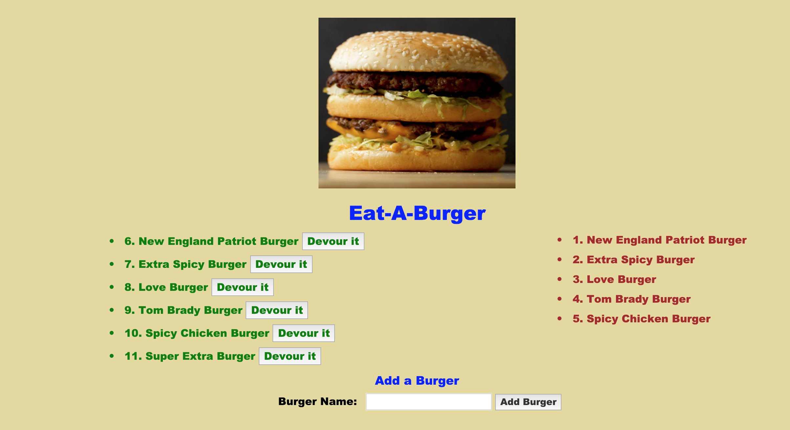

# EatDaBurger

## Overview
A handlebars app where MySQL and Node.js are used for burgers that are stored in MySQL. The user enters a burger, which gets added to the database and if the burger is eaten, it's considered devoured. The user can continue to add new burgers, but cannot bring back devoured burgers.

## Technologies

### Frontend:
* HTML
* CSS
* Bootstrap
* Javascript (jQuery)
* Handlebars
### Backend:
* Nodejs
* Mysql
* Express
* jawsDB
* Heroku

## Dependencies:
* body-parser
* dotenv
* express
* express-handlebars
* method-override
* mysql

## Functionality:
Using (Object Relational Mapper)ORM, the app has three methods:
1. **POST:** A new burger using the Place Order form, which allows us to create burgers 
#### Screenshot of added Burger

#### Screenshot of added in MySQl

    
2. **GET:** View a list of burgers available to eat 

2. **PUT:** A selected burger by clicking Devour It
   

### Link to Heroku
* <strong>[Burger!](https://warm-lake-16801.herokuapp.com/)</strong>

